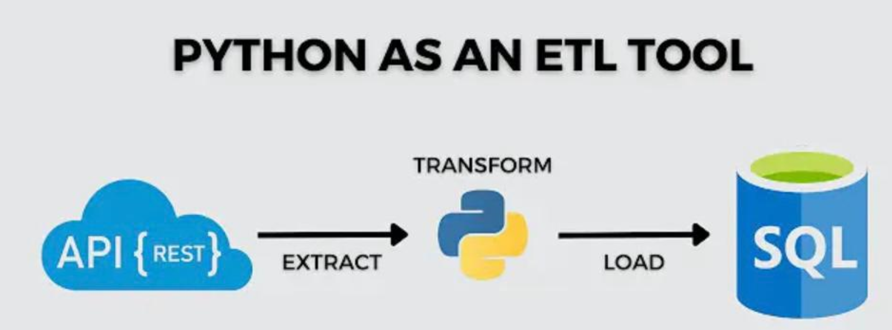

# Pull_data_from_API

# Extracting the data from Crypto-Currency API and loading it in Mysql Database Using Python 


## Modules/Libraries Used

This project uses the following Python modules:

- **requests**: To send HTTP requests to APIs and retrieve data.
- **pandas**: For data manipulation and analysis, especially for handling data in DataFrame format.
- **sqlalchemy**: For database interaction and managing SQL queries.

### Installation

To install the required libraries, you can use `pip`. Run the following command in your terminal:

```bash
pip install requests pandas sqlalchemy


